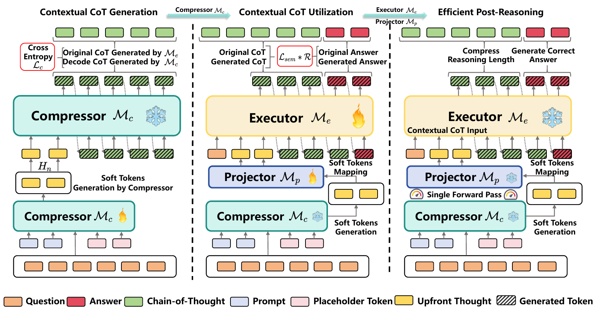

# Can Reasoning Path still be Effective as Input? Bridging Post-Reasoning to Chain-of-Thought Compression

This repository contains code for *Can Reasoning Path still be Effective as Input? Bridging Post-Reasoning to Chain-of-Thought Compression* (https://arxiv.org/abs/2308.07272, ACL 2024) by Chengzhengxu Li, Xiaoming Liu*, Zhaohan Zhang, Shengchao Liu, Guoxin Ma, Yu Lan, Cong Wang, Chao Shen. In this codebase, we provide UCoT, an efficient post-reasoning framework for Chain-of-Thought (CoT) compression. UCoT shifts the reasoning burden to the input stage by using a lightweight compressor to generate contextual soft tokens, significantly reducing inference latency. Experimental results on mathematical benchmarks show that UCoT outperforms SOTA compression methods in both efficiency and accuracy. In subsequent analysis, we also verify UCoT’s strong universality, robustness, and generalization ability across various LLMs and tasks.

